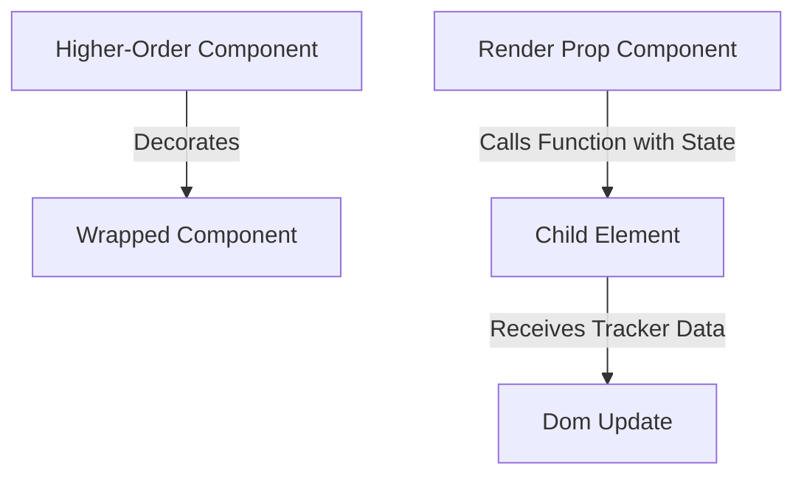

# Experiment 6: Advanced React Patterns

<div align="center">
  
  
</div>

## Project Overview

This repository contains the codebase for **Advanced React Patterns**, implemented as part of the College Experiment of Full Stack 2 curriculum. The objective of this experiment is to explore Higher-Order Components (HOC) and Render Props for better logic separation and reusability.

## Architecture & Data Flow



## Core Components

| Component | Responsibility | Technologies Used |
|-----------|----------------|-------------------|
| `withLogging` | A Higher-Order Component returning enhanced properties | React Pattern |
| `MouseTracker`| Implements the Render Props strategy to expose coordinate data | React Pattern |
| `App.tsx` | Instantiates tests for complex component combinations | TSX |

## Key Features

- **Higher-Order Components**: Intercepting and augmenting components without modifying their source code.
- **Render Props**: Providing isolated internal state (like mouse coordinates) to independent layout functions.
- **Code Portability**: Utilizing patterns that enable flexible logic sharing across codebases.
- **Decoupled Architecture**: Separating data calculation from visual rendering nodes.

## Getting Started

### Prerequisites
- Node.js (v16 or higher)

### Installation
```bash
npm install
npm run dev
```


## Source Code (`App.tsx`)

```tsx
import { useState } from 'react';
import './App.css';

// 1. Higher-Order Component (HOC) Pattern
const withLogging = (WrappedComponent: any) => {
  return (props: any) => {
    console.log(`Rendering ${WrappedComponent.name} with props:`, props);
    return <WrappedComponent {...props} />;
  };
};

const SimpleCard = ({ title, content }: { title: string, content: string }) => (
  <div className="card">
    <h3>{title}</h3>
    <p>{content}</p>
  </div>
);

const LoggedCard = withLogging(SimpleCard);

// 2. Render Prop Pattern
const MouseTracker = ({ render }: { render: (pos: { x: number, y: number }) => JSX.Element }) => {
  const [position, setPosition] = useState({ x: 0, y: 0 });

  const handleMouseMove = (event: React.MouseEvent) => {
    setPosition({ x: event.clientX, y: event.clientY });
  };

  return (
    <div className="tracker-area" onMouseMove={handleMouseMove}>
      {render(position)}
    </div>
  );
};

function App() {
  return (
    <div className="advanced-lab">
      <h1>Experiment 8: Advanced React Patterns</h1>
      <p>Demonstrating HOCs and Render Props for code reuse and logic separation.</p>

      <section className="section">
        <h3>Pattern 1: Higher-Order Component</h3>
        <div className="card-container">
          <LoggedCard title="HOC Pattern" content="This component is wrapped by withLogging which tracks its render lifecycle." />
        </div>
      </section>

      <section className="section">
        <h3>Pattern 2: Render Prop Pattern</h3>
        <MouseTracker render={({ x, y }) => (
          <div className="result-box">
            <p>Mouse Position: <span>{x}, {y}</span></p>
          </div>
        )} />
      </section>
    </div>
  );
}

export default App;

```
